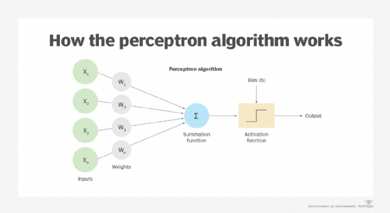
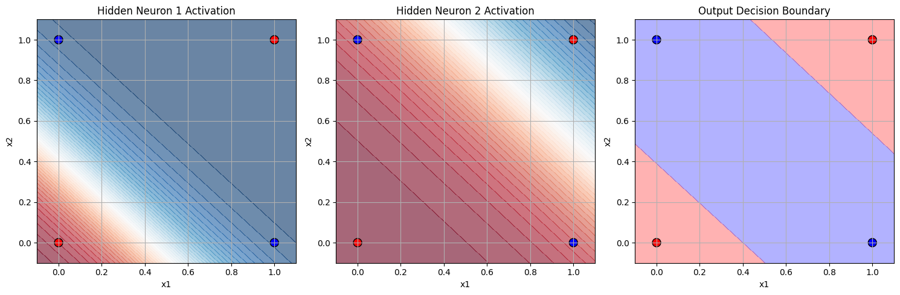

# Perceptron Implementation

## Day 1: Perceptron and Logic Gates

### Introduction to Perceptron
A perceptron is an artificial neuron and the simplest form of a neural network used for binary classification tasks. It takes several binary inputs, applies weights to them, sums them up, and passes the result through an activation function.



The mathematical representation of a perceptron:
```
y = f(∑(wi⋅xi) + b)
```

Where:
- `wi` are the weights
- `xi` are the inputs
- `b` is the bias
- `f` is the activation function

### Implementation Steps

1. **Setup Environment**
   - Imported necessary libraries (NumPy, Matplotlib)
   - Created training data for AND, OR, and XOR logic gates

2. **Visualized Logic Gates**
   - Created visualization function to plot the training data points
   - Displayed AND, OR, and XOR gate representations
   - Observed that AND and OR gates are linearly separable
   - Confirmed that XOR gate is not linearly separable with a single line

3. **Implemented Single-Layer Perceptron**
   - Created a Perceptron class with:
     - Initialization of weights and bias
     - Step activation function
     - Prediction method
     - Training method using the perceptron learning rule
   - Trained the perceptron on AND and OR gates
   - Demonstrated that a single perceptron fails to learn XOR

4. **Advanced Concepts**
   - Implemented sigmoid activation function: `σ(x) = 1/(1 + e^(-x))`
   - Defined binary cross-entropy loss function: `L = -[y * log(p) + (1-y) * log(1-p)]`

5. **Multi-Layer Perceptron (MLP) Implementation**
   - Created MLP class with:
     - Input layer, hidden layer, and output layer
     - Forward propagation method
     - Backward propagation method with gradient descent
     - Training and prediction methods
   - Successfully trained MLP on XOR gate problem
   - Demonstrated that MLP can solve non-linearly separable problems

6. **Visualization of MLP Decision Boundaries**
   - Plotted hidden neuron activations
   - Visualized the decision boundary created by MLP
   - Showed how combining multiple linear boundaries creates a non-linear boundary

### Results
- Single-layer perceptron: Successfully learned AND and OR gates
- Single-layer perceptron: Failed to learn XOR gate
- Multi-layer perceptron: Successfully learned XOR gate

### Conclusion
This implementation demonstrates the limitation of single-layer perceptrons (can only learn linearly separable functions) and the power of multi-layer perceptrons to learn more complex, non-linearly separable functions.


